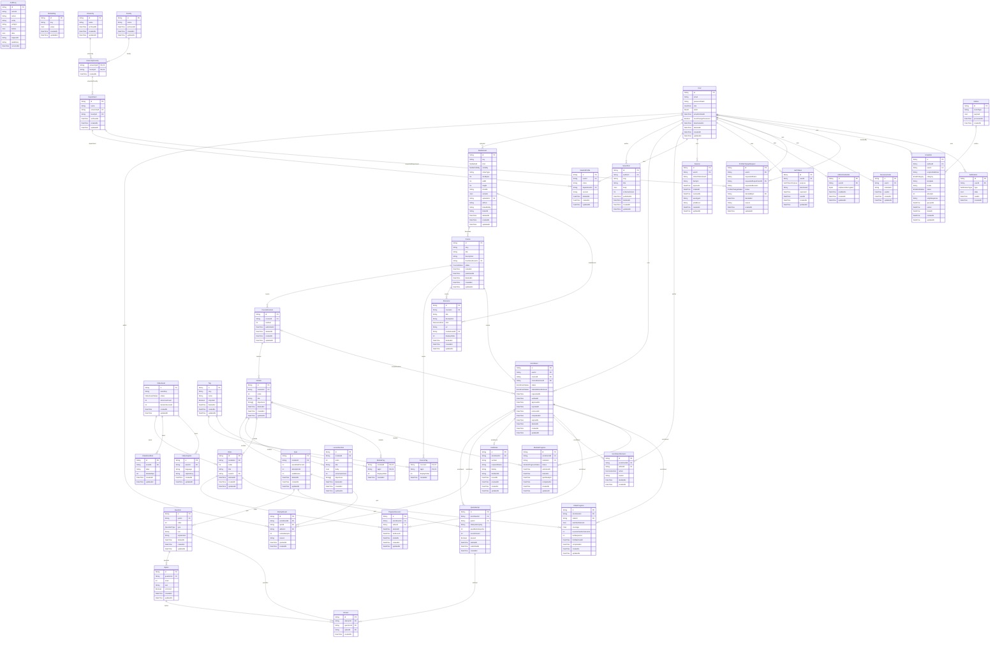

# Data model

Generated from `packages/db/prisma/schema` by `pnpm --filter @heat/db er-diagram`. Do not edit it by hand: a test fails when it is stale.

```mermaid
erDiagram
  Quiz {
    String id PK
    String moduleId FK
    Int passMarkPercent
    Int attemptLimit
    Int waitMinutes
    DateTime deletedAt
    DateTime createdAt
    DateTime updatedAt
  }
  Question {
    String id PK
    String quizId FK
    Int order
    QuestionType type
    String text
    String explanation
    DateTime deletedAt
    DateTime createdAt
    DateTime updatedAt
  }
  Option {
    String id PK
    String questionId FK
    Int order
    String text
    Boolean isCorrect
    DateTime createdAt
    DateTime updatedAt
  }
  QuizAttempt {
    String id PK
    String enrollmentId FK
    String quizId FK
    String idempotencyKey
    Int passMarkSnapshot
    Int scorePercent
    Boolean passed
    DateTime startedAt
    DateTime submittedAt
    DateTime createdAt
  }
  Answer {
    String id PK
    String attemptId FK
    String questionId FK
    String optionId FK
    DateTime createdAt
  }
  AttemptGrant {
    String id PK
    String enrollmentId FK
    String quizId FK
    String adminId FK
    Int extraAttempts
    String reason
    DateTime grantedAt
    DateTime createdAt
  }
  AuditLog {
    String id PK
    String actorId
    String action
    String entity
    String entityId
    Json before
    Json after
    String requestId
    String ipAddress
    DateTime occurredAt
  }
  Course {
    String id PK
    String slug
    String title
    String description
    String thumbnailAssetId FK
    CourseStatus status
    DateTime lockedAt
    DateTime publishedAt
    DateTime deletedAt
    DateTime createdAt
    DateTime updatedAt
  }
  CourseRevision {
    String id PK
    String courseId FK
    Int number
    DateTime publishedAt
    DateTime deletedAt
    DateTime createdAt
    DateTime updatedAt
  }
  Module {
    String id PK
    String revisionId FK
    Int order
    String title
    String[] objectives
    DateTime deletedAt
    DateTime createdAt
    DateTime updatedAt
  }
  LessonSection {
    String id PK
    String moduleId FK
    Int order
    String title
    Json body
    Int schemaVersion
    String[] objectives
    DateTime deletedAt
    DateTime createdAt
    DateTime updatedAt
  }
  VideoAsset {
    String id PK
    String assetKey
    VideoAssetStatus status
    Int referenceCount
    Int durationSeconds
    DateTime createdAt
    DateTime updatedAt
  }
  Video {
    String id PK
    String moduleId FK
    Int order
    String title
    String assetId FK
    DateTime deletedAt
    DateTime createdAt
    DateTime updatedAt
  }
  VideoRendition {
    String id PK
    String assetId FK
    String label
    Int bitrateKbps
    DateTime createdAt
    DateTime updatedAt
  }
  VideoCaption {
    String id PK
    String assetId FK
    String language
    String captionKey
    DateTime createdAt
    DateTime updatedAt
  }
  Tag {
    String id PK
    String slug
    String name
    Boolean isSystem
    DateTime deletedAt
    DateTime createdAt
    DateTime updatedAt
  }
  CourseTag {
    String courseId PK, FK
    String tagId PK, FK
    Int displayOrder
    DateTime createdAt
  }
  ModuleTag {
    String moduleId PK, FK
    String tagId PK, FK
    Int displayOrder
    DateTime createdAt
  }
  SiteSetting {
    String id PK
    String key
    Json value
    DateTime createdAt
    DateTime updatedAt
  }
  Certificate {
    String id PK
    String enrollmentId FK
    String number
    String recipientName
    String fileKey
    String fileSha256
    DateTime issuedAt
    DateTime revokedAt
    DateTime createdAt
    DateTime updatedAt
  }
  MediaAsset {
    String id PK
    String key
    MediaKind kind
    MediaVisibility visibility
    String mimeType
    Int sizeBytes
    Int width
    Int height
    String sha256
    Json variants
    String uploaderId FK
    String altText
    String linkedEntity
    String linkedId
    DateTime deletedAt
    DateTime createdAt
    DateTime updatedAt
  }
  Resource {
    String id PK
    String courseId FK
    String title
    String description
    ResourceKind kind
    String url
    String mediaAssetId FK
    Int displayOrder
    DateTime deletedAt
    DateTime createdAt
    DateTime updatedAt
  }
  NewsPost {
    String id PK
    String authorId FK
    String slug
    String title
    Json body
    Int schemaVersion
    DateTime publishedAt
    DateTime deletedAt
    DateTime createdAt
    DateTime updatedAt
  }
  University {
    String id PK
    String name
    DateTime archivedAt
    DateTime createdAt
    DateTime updatedAt
  }
  Faculty {
    String id PK
    String name
    DateTime archivedAt
    DateTime createdAt
    DateTime updatedAt
  }
  UniversityFaculty {
    String universityId PK, FK
    String facultyId PK, FK
    DateTime createdAt
  }
  Department {
    String id PK
    String name
    String universityId FK
    String facultyId FK
    DateTime archivedAt
    DateTime createdAt
    DateTime updatedAt
  }
  Enrollment {
    String id PK
    String userId FK
    String courseId FK
    String courseRevisionId FK
    EnrollmentStatus status
    EnrollmentStatus statusBeforeRemoval
    DateTime requestedAt
    DateTime verifiedAt
    DateTime approvedAt
    DateTime rejectedAt
    DateTime removedAt
    DateTime completedAt
    DateTime expiredAt
    DateTime deletedAt
    DateTime createdAt
    DateTime updatedAt
  }
  EnrollmentDecision {
    String id PK
    String enrollmentId FK
    String adminId FK
    DecisionAction action
    String reason
    DateTime decidedAt
    DateTime createdAt
  }
  User {
    String id PK
    String email
    String passwordHash
    UserRole role
    Realm realm
    DateTime emailVerifiedAt
    Boolean mustChangePassword
    DateTime deactivatedAt
    DateTime deletedAt
    DateTime createdAt
    DateTime updatedAt
  }
  StudentProfile {
    String id PK
    String userId FK
    String name
    String departmentId FK
    String session
    DateTime deletedAt
    DateTime createdAt
    DateTime updatedAt
  }
  Session {
    String id PK
    String userId FK
    String refreshTokenHash
    String familyId
    DateTime expiresAt
    DateTime rotatedAt
    DateTime revokedAt
    String userAgent
    String ipAddress
    DateTime createdAt
    DateTime updatedAt
  }
  AuthToken {
    String id PK
    String userId FK
    AuthTokenPurpose purpose
    String tokenHash
    DateTime expiresAt
    DateTime usedAt
    DateTime createdAt
    DateTime updatedAt
  }
  AdminCredential {
    String id PK
    String userId FK
    Bytes totpSecretEncrypted
    DateTime enabledAt
    DateTime createdAt
    DateTime updatedAt
  }
  RecoveryCode {
    String id PK
    String userId FK
    String codeHash
    DateTime usedAt
    DateTime createdAt
    DateTime updatedAt
  }
  ProfileChangeRequest {
    String id PK
    String userId FK
    String requestedName
    String requestedDepartmentId FK
    String requestedSession
    ProfileChangeStatus status
    String decidedById FK
    DateTime decidedAt
    String reason
    DateTime createdAt
    DateTime updatedAt
  }
  PlaybackSession {
    String id PK
    String enrollmentId FK
    String videoId FK
    DateTime startedAt
    DateTime lastSeenAt
    DateTime endedAt
    DateTime createdAt
    DateTime updatedAt
  }
  VideoProgress {
    String id PK
    String enrollmentId FK
    String videoId FK
    Json watchedIntervals
    Float coverage
    Int resumePositionSeconds
    Int lastSequence
    DateTime firstWatchedAt
    DateTime completedAt
    DateTime createdAt
    DateTime updatedAt
  }
  ModuleProgress {
    String id PK
    String enrollmentId FK
    String moduleId FK
    ModuleProgressStatus status
    DateTime unlockedAt
    DateTime startedAt
    DateTime quizReadyAt
    DateTime completedAt
    DateTime createdAt
    DateTime updatedAt
  }
  Outbox {
    String id PK
    String eventType
    Json payload
    DateTime processedAt
    DateTime createdAt
  }
  EmailJob {
    String id PK
    String outboxId FK
    String userId FK
    String recipientAddress
    EmailCategory category
    String template
    String locale
    EmailJobStatus status
    Int attempts
    String smtpResponse
    DateTime queuedAt
    DateTime sentAt
    DateTime failedAt
    DateTime createdAt
    DateTime updatedAt
  }
  Notification {
    String id PK
    String userId FK
    NotificationType type
    Json data
    DateTime readAt
    DateTime createdAt
  }
  Module ||--o| Quiz : module
  Quiz ||--o{ Question : quiz
  Question ||--o{ Option : question
  Enrollment ||--o{ QuizAttempt : enrollment
  Quiz ||--o{ QuizAttempt : quiz
  QuizAttempt ||--o{ Answer : attempt
  Question ||--o{ Answer : question
  Option ||--o{ Answer : option
  Enrollment ||--o{ AttemptGrant : enrollment
  Quiz ||--o{ AttemptGrant : quiz
  User ||--o{ AttemptGrant : admin
  MediaAsset |o--o{ Course : thumbnail
  Course ||--o{ CourseRevision : course
  CourseRevision ||--o{ Module : revision
  Module ||--o{ LessonSection : module
  Module ||--o{ Video : module
  VideoAsset ||--o{ Video : asset
  VideoAsset ||--o{ VideoRendition : asset
  VideoAsset ||--o{ VideoCaption : asset
  Course ||--o{ CourseTag : course
  Tag ||--o{ CourseTag : tag
  Module ||--o{ ModuleTag : module
  Tag ||--o{ ModuleTag : tag
  Enrollment ||--o| Certificate : enrollment
  User ||--o{ MediaAsset : uploader
  Course |o--o{ Resource : course
  MediaAsset |o--o{ Resource : mediaAsset
  User ||--o{ NewsPost : author
  University ||--o{ UniversityFaculty : university
  Faculty ||--o{ UniversityFaculty : faculty
  UniversityFaculty ||--o{ Department : universityFaculty
  User ||--o{ Enrollment : user
  Course ||--o{ Enrollment : course
  CourseRevision |o--o{ Enrollment : courseRevision
  Enrollment ||--o{ EnrollmentDecision : enrollment
  User ||--o{ EnrollmentDecision : admin
  User ||--o| StudentProfile : user
  Department ||--o{ StudentProfile : department
  User ||--o{ Session : user
  User ||--o{ AuthToken : user
  User ||--o| AdminCredential : user
  User ||--o{ RecoveryCode : user
  User ||--o{ ProfileChangeRequest : user
  User |o--o{ ProfileChangeRequest : decidedBy
  Department |o--o{ ProfileChangeRequest : requestedDepartment
  Enrollment ||--o{ PlaybackSession : enrollment
  Video ||--o{ PlaybackSession : video
  Enrollment ||--o{ VideoProgress : enrollment
  Video ||--o{ VideoProgress : video
  Enrollment ||--o{ ModuleProgress : enrollment
  Module ||--o{ ModuleProgress : module
  Outbox |o--o{ EmailJob : outbox
  User |o--o{ EmailJob : user
  User ||--o{ Notification : user
```
